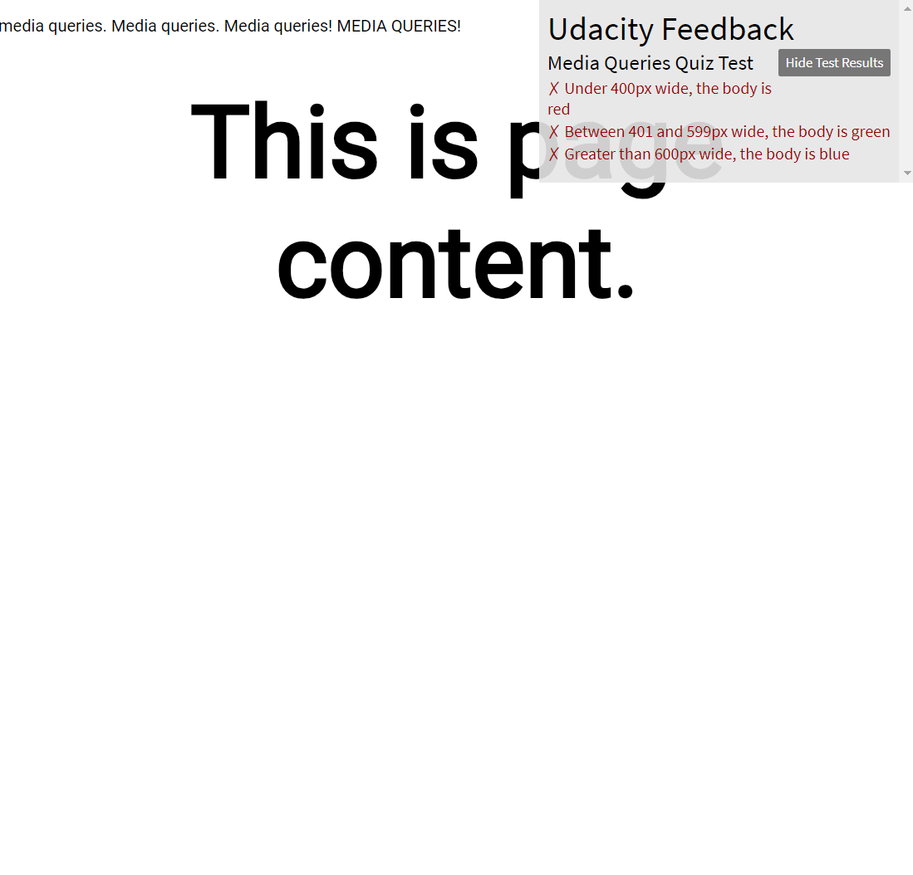
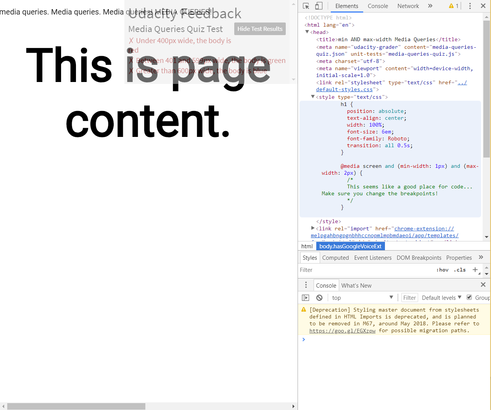
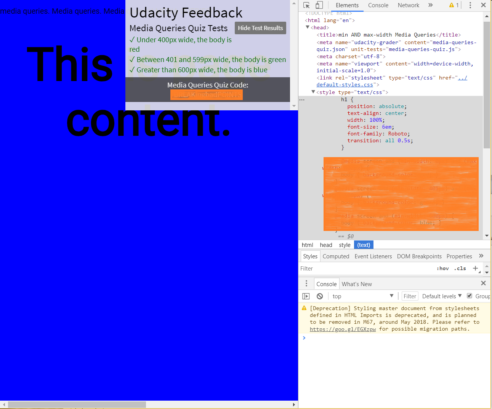
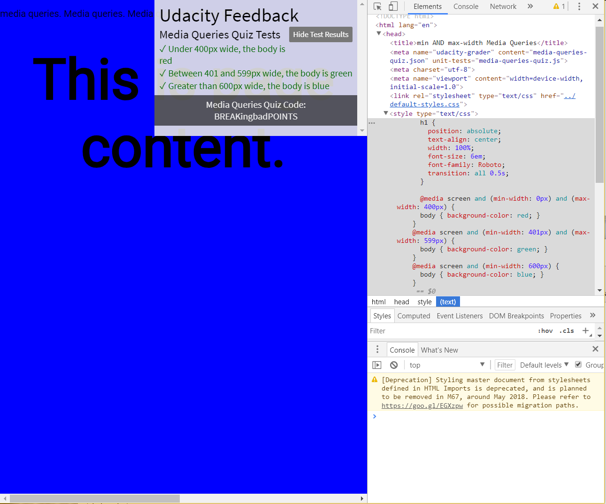

# Lesson 3.6 Quiz: Which styles are applied

##### Quiz:
[Link to the Quiz](http://udacity.github.io/RWDF-samples/quizzes/media-queries-quiz.html)

Objective: 
- Between 0 and 400 pixels, set background color to red.
- Between 401 pixels and 599 pixels set the background to green.
- 600 pixels or wider, set the background color to blue.

<details>
  <summary>SOLUTION</summary>
  <p>
  
  ```
  @media screen and (min-width: 0px) and (max-width: 400px) {
    body { background-color: red; }
  }
  @media screen and (min-width: 401px) and (max-width: 599px) {
    body { background-color: green; }
  }
  @media screen and (min-width: 600px) {
    body { background-color: blue; }
  }
  ```
  
  </p>
</details>

- - -

##### Troubleshooting: 
- Configure Udacity Front End Feedback
    - In a Chrome tab go to chrome://extensions/ 
    - Find the Udacity extension
    - Check the option : "Allow access to file URLs"
    - Now go to the tab that have the .html file you are using, click the Udacity extension and check the box that says "allow feedback on this domain." It should give you feedback once you check the box.

[Link to the Quiz](http://udacity.github.io/RWDF-samples/quizzes/media-queries-quiz.html)

1. This is what you should see when you first open the page:



2. Do the following:
  - Open Chrome Dev Tools.
  - Open Elements tab
  - Open `<head>`
  - Open `<style>`



3. Modify the style tag to fulfill the quiz objective. The page should change color. The Udacity Feedback Tool will display a special code:



<details>
  <summary>SOLUTION</summary>
  <p>
  
  
  </p>
</details>


- - -
Next up: [Breakpoints](ND024_Part2_Lesson03_07.md) or return to [Table Of Contents](./ND024_TableOfContents.md)
