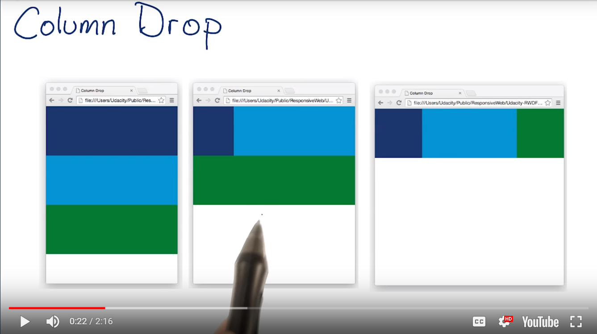

# Lesson 4.2 Pattern - Column Drop

Column drop is the easiest.



Example code of column drop:
```
.container {
  display: flex;
  flex-wrap: wrap;
}
.box {
  width: 100%;
}
@media screen and (min-width: 450px) {
  .dark_blue {
    width: 25%;
  }
  .ligth_blue {
    width: 75%;
  }
}
@media screen and (min-width: 550px) {
  .dark_blue, .green {
  width: 25%;
  }
  .light_blue {
    width: 50%;
  }
}
...
<div class="container">
  <div class="box dark_blue"></div>
  <div class="box light_blue"></div>
  <div class="box green"></div>
</div>
```

- - -
Next up: [Pattern - Mostly Fluid](ND024_Part2_Lesson04_03.md) or return to [Table Of Contents](./ND024_TableOfContents.md)
