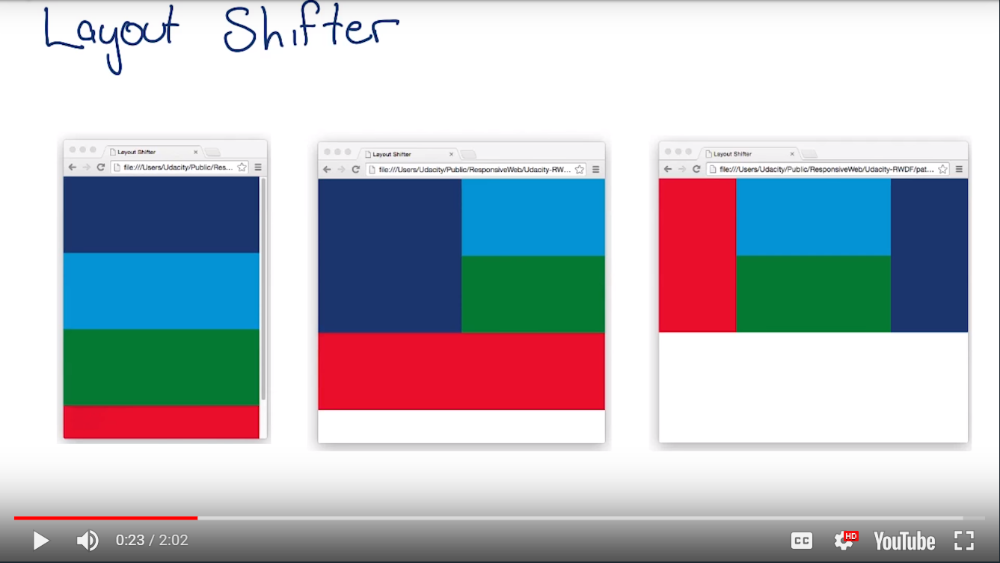

# Lesson 4.7 Pattern - Layout Shifter

Layout shifter uses the item order to move things around at different breakpoints.



Example code:
```
.box {
  width: 100%;
}

@media screen and (min-width: 500px) {
  .dark_blue {
    width: 50%;
  }
  #container2 {
    width: 50%;
  }
}

@media screen and (min-width: 600px) {
  .dark_blue {
    width: 25%;
    order: 1;
  }
  #container2 {
    width:50%;
  }
  .red {
    width: 25%;
    order: -1;
  }
}
```


- - -
Next up: [Quiz: Which is Which?](ND024_Part2_Lesson04_08.md) or return to [Table Of Contents](./ND024_TableOfContents.md)
