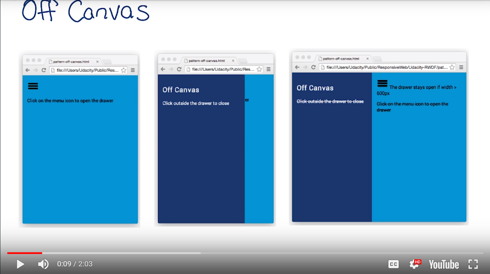

# Lesson 4.9 Pattern - Off Canvas



Example code:
http://udacity.github.io/RWDF-samples/Lesson4/patterns/off-canvas.html

```
html, body, main {
  height: 100%;
  width: 100%;
}

nav {
  width: 300px;
  position: absolute;
  /* This trasform moves the drawer off canvas. */
  -webkit-transform: translate(-300px, 0);
  transform: translate(-300px, 0);
  /* Optionally, we animate the drawer. */
  transition: transform 0.3s ease;
}
nav.open {
  -webkit-transform: translate(0, 0);
  transform: translate(0, 0);
}

@media screen and (min-width: 600px) {
  nav {
    position: relative;
    transform: translate(0,0);
  }
  body {
    display: flex;
    flex-flow: row nowrap;
  }
  main {
    width: auto;
    flex-grow: 1;
  }
}


<nav id="drawer" class="dark_blue">
</nav>
<main class="light_blue">
</main>

menu.addEventListener('click', function(e) {
  drawer.classList.toggle('open');
  e.stopPropagation();
});
```

- - -
Next up: [Quiz: Off Canvas Visualization](ND024_Part2_Lesson04_10.md) or return to [Table Of Contents](./ND024_TableOfContents.md)
