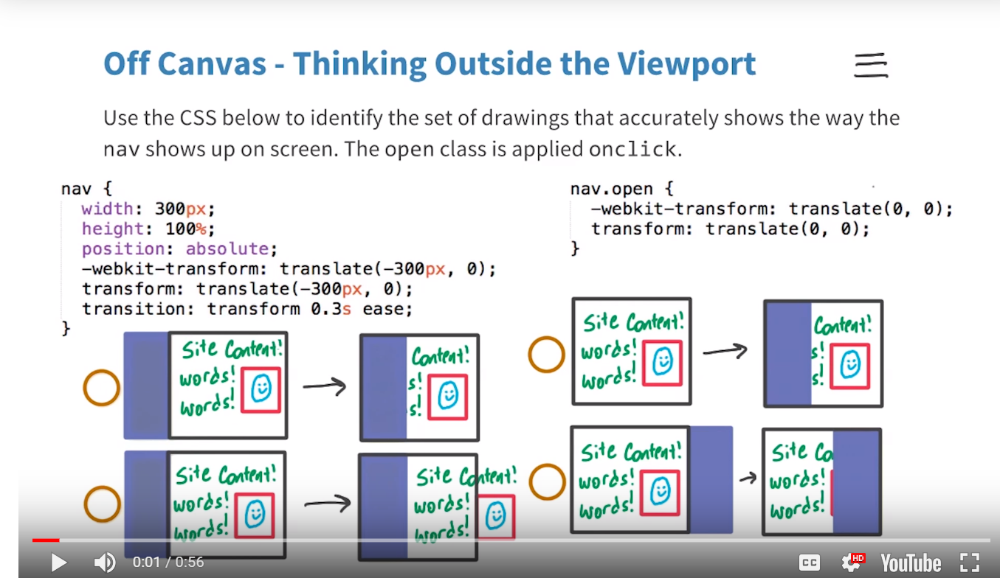

# Lesson 4.10 Quiz: Off Canvas Visualization

##### Quiz:

##### Solution:
- [X] Upper-Left. Correct.
- [ ] Bottom-Left. Incorrect. It does not push the original content outside the canvas. `position: absolute` means that the content will stay put and get covered over.
- [ ] Upper-Right. Incorrect. It does not magically appear from nowhere. It was just shifted off canvas.
- [ ] Bottom-Right. Incorrect. `translate(-300px, 0)` means that it's starting 300px to the left.

- - -
Next up: [Quiz: Project Update Part 2](ND024_Part2_Lesson04_11.md) or return to [Table Of Contents](./ND024_TableOfContents.md)
