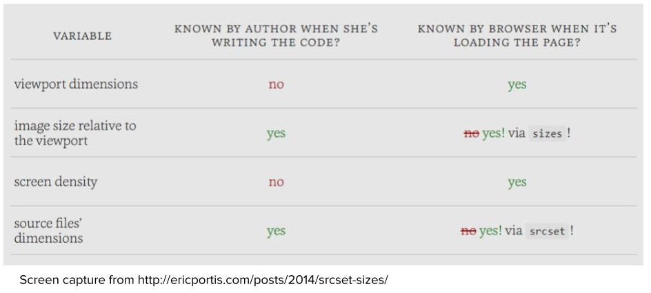

# Lesson 9.2 srcset

The problem with the plain old image source attribute is that it only gives one URL for one image. 

**Source set to the rescue.**

There's a vast variety of screens, ppi, pixel density out there.


To check your DPR (device pixel ratio) in your browser, open chrome dev tools, and type in window.devicePixelRatio in console.

srcset is ignored by browsers that don't understant it and fallback onto the old src attribute.

The W unit will tell the browser the width of the images it can choose from.



Example code of `<picture>`:
```
<picture>

  <source src="large.jpg"
          media="( (min-device-pixel-ratio: 1.5) and (min-width: 20.001em) and (max-width: 35.999em) ) or
                 ( (max-device-pixel-ratio: 1.5) and (min-width: 120.001em) ) or
                 ( (min-device-pixel-ratio: 1.5) and (min-width: 60.001em) )" />
  <source src="medium.jpg"
          media="( (max-device-pixel-ratio: 1.5) and (min-width: 20.001em) and (max-width: 35.999em) ) or
                 ( (max-device-pixel-ratio: 1.5) and (min-width: 60.001em) ) or
                 ( (min-device-pixel-ratio: 1.5) and (min-width: 10.001em) )" />
  <source src="small.jpg" />

  <!-- fallback -->
  

</picture>
```

- - -
Next up: [Sizes Attribute](ND024_Part2_Lesson09_03.md) or return to [Table Of Contents](./ND024_TableOfContents.md)
