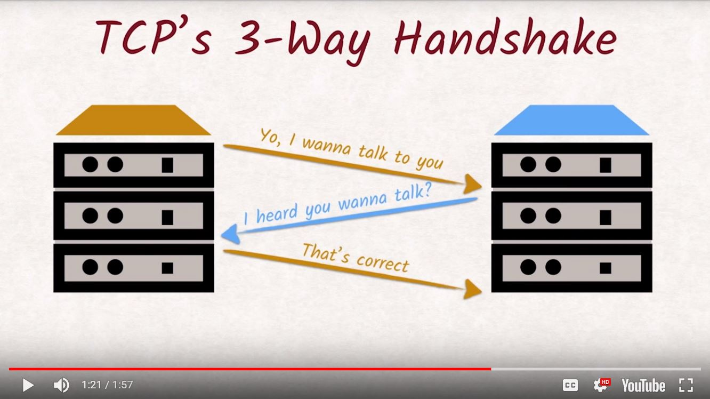

# Lesson 2.10 Performance Basics

We have manually written our own request directed to the wire and received a response from the server just as the server send it. It feels raw, close to the biometal doesn't it? Like there's almost no software between us and the bytes being sent and yet, there's still so much happening that we can't directly see and it actually has a big impact on how fast the entire request response process is. If we are familiar with networking architecture, we might know that HTTP is not the entire story, that's merely the protocol. For a more complete picture, we are using HTTP on top of TCP, on top of IP, on top of Ethernet. We don't need to understand each of these layers but TCP in particular has a big impact on how we should structure our requests to have them perform well and it warrants a closer look. The Internet Protocol allows us to talk to other machines on the internet while TCP allows us to have multiple independent streams of data between these 2 machines. These streams are distinguished by port numbers. The TCP protocol also ensures that no packages get lost and that they arrive in the right order. All of this requires precautions that cost time and resources. Opening a new connection is especially costly as the TCP handshake, which makes sure both machines are aware of the newly created communication channel has to be executed that requires 2 round trips. If we're using HTTPS, the additional TLS handshake has to be executed as well. If HTTPS and TLS are new to us, stick around and we'll talk about them in the next lesson. once all that is done, the actual HTTP protocol can finally take over. Head-of-line blocking is a huge bottleneck to website performance. Browsers being able to open up six parallel connections helps, but it's not great. Later, we'll see how HTTP/2 fix this issues with head-of-line blocking.

- - -
Next up: [Performance Details](ND024_Part4_Lesson02_11.md) or return to [Table Of Contents](./ND024_TableOfContents.md)
