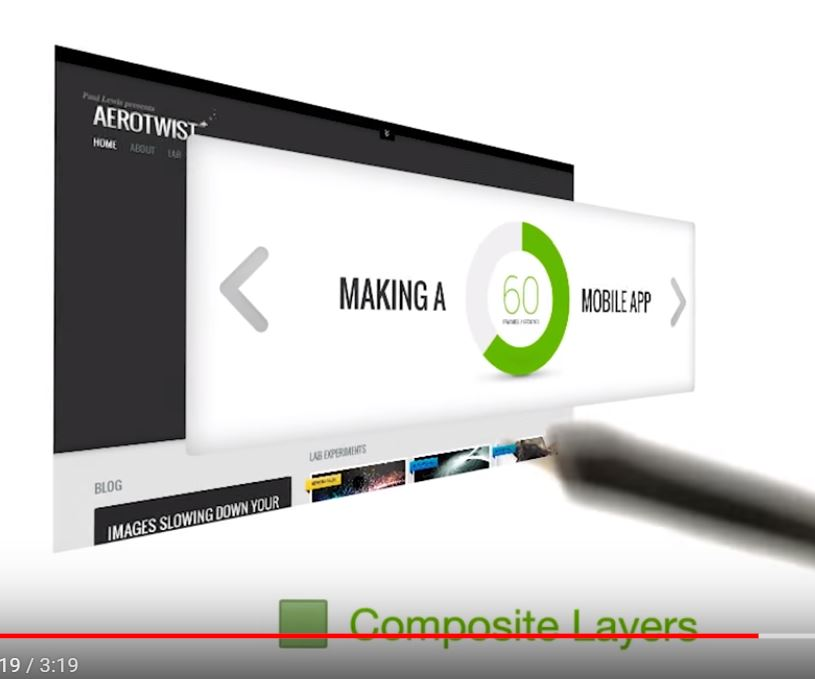

# Lesson 9.9 DOM, CSSOM, Render Tree

Okay, back to the rendering process of a single frame. Once the browser knows which rules apply to an element, it can begin calculate layout. Or it, in other words, how much space elements take up and where they are on the screen. So, here's all the CSS that we want to apply. And layout turns this into a collection of boxes like this. 

In the tooling, you'll see this as layout. The web's layout model means that one element can affect others. So, for example, the width of body typically affects the children's widths and so on, all the way down the tree. So the process can be quite involved for the browser. Sometimes, you may hear layout called reflow. It's the same thing. 

The next step in the process is to talk about vector to raster. For example, the boxes we had before were vectors like this, just shapes. 

But now what we need to do is fill in individual pixels, like this. And that's what a rasterizer is for. So, this is the layout we had before, and these are the draw calls that the rasterizer will make to fill it in. When done, it will look like this. But that's a little too quick, so let's step through and see it build up the picture bit by bit. So you can see, these rectangles start to appear, then some text. And we get a shadow, a white line, a picture, and finally it tightens up. The tooling is going to show you this as paint. You may have noticed in that previous list that one of the calls was called draw bitmap. What we normally do is we send things like JPEGs, or PNGs or GIFs down the wire to our page. But what the browser has to do is decode these into memory, like this. 

In the tooling, you'll see it as image decode. Potentially, we're doing something like responsive web design. And so the image may also need resizing. Painting, as you may have noticed just now, was done into a single surface. However, sometimes browsers make multiple surfaces called **layers** or compositor layers and it can paint into those individually. So here I have a site and this masthead has its own layer. That means we can paint the concept behind. And we can paint the masthead itself. 

The process of handling these layers is shown in the tooling as composite layers. This masthead is a layer, but because we have buttons for next and previous on top of it they are also turned into layers as well. In this course, we're going to talk about layer management to make sure that you don't create extra layers by accident. Now, we can put all these layers back together. And so now we've finished painting all the layers for our page. To be honest, painting actually happens into a grid of tiles like this. I mentioned it for completeness, but it's not something we get to control as developers. All of this happened on the CPU. The layers themselves and their tiles will be uploaded to the GPU. 

Again, this will be included in composite layers. And lastly, the GPU will be instructed to put the pictures up on the screen. And that, in brief, is how we get from a single request all the way through to pixels on screen.

- - -
Next up: [Quiz: Layout](ND024_Part4_Lesson09_10.md) or return to [Table Of Contents](./ND024_TableOfContents.md)
