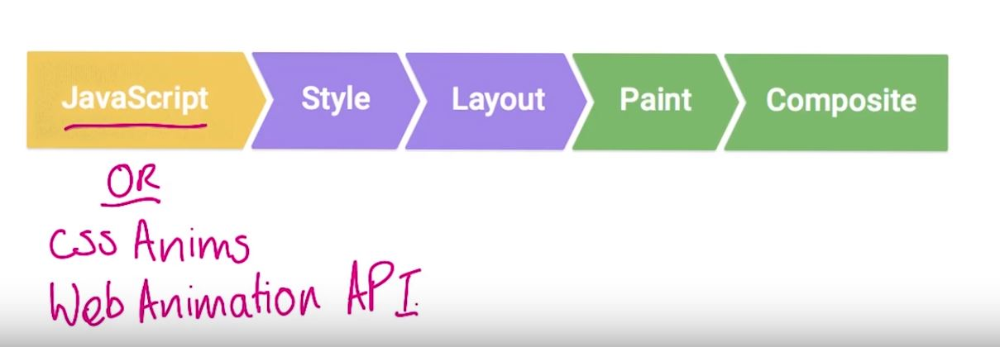

# Lesson 9.11 Layout and Paint

So this is what a typical frame looks like for as developers when things are more than just a static page. It looks like the pipeline I talked about just before except I've now chucked JavaScript at the front. Normally, you're going to use JavaScript to handle work that will result in visual changes. Whether it's jQuery's animate function, sorting a data set, or adding DOM elements to the page. But you don't have to use JavaScript for your visual changes. In fact, for many applications developers use CSS animations, transitions, or even the new Web Animations API to make visual changes to their page. Now with that out of the way, we can talk about the pipeline a bit more. The changes we make here won't necessarily trigger every part of the pipeline either. In fact, there are three ways the pipeline normally plays out for a given frame. So let's talk about those for a second. 

So number one, you make a visual change either with CSS Or JavaScript. The browser must recalculate the styles of the elements that were affected. Now if you changed a layout property, so that's one that changed an element's geometry like its width, height, or position with relation to another element like left or top, then the browser will have to check all the other elements and re-flow the page. Any affected areas will need to be repainted. And the final painted elements will need to be composited back together. 

The second way the pipeline gets used is when you change a paint only property, like background image, text color, or shadows. This time, we make the change, the styles are calculated, we don't do layout because we didn't change the geometry of any elements. We do paint and we do composite. 

And the last way involves changing something that requires neither layout, nor paint, just compositing. Compositing is where the browser puts the individual layers of the page together. And that requires layer management to ensure we have the right layers, and in the correct order. So we make our change. We do style calculations, but we only do composite. You probably noticed that style was always included for each of those variations. Different styles affect which parts of the pipeline we touch? And therefore the performance characteristics of our apps.

- - -
Next up: [Quiz: Rendering Quiz](ND024_Part4_Lesson09_12.md) or return to [Table Of Contents](./ND024_TableOfContents.md)
