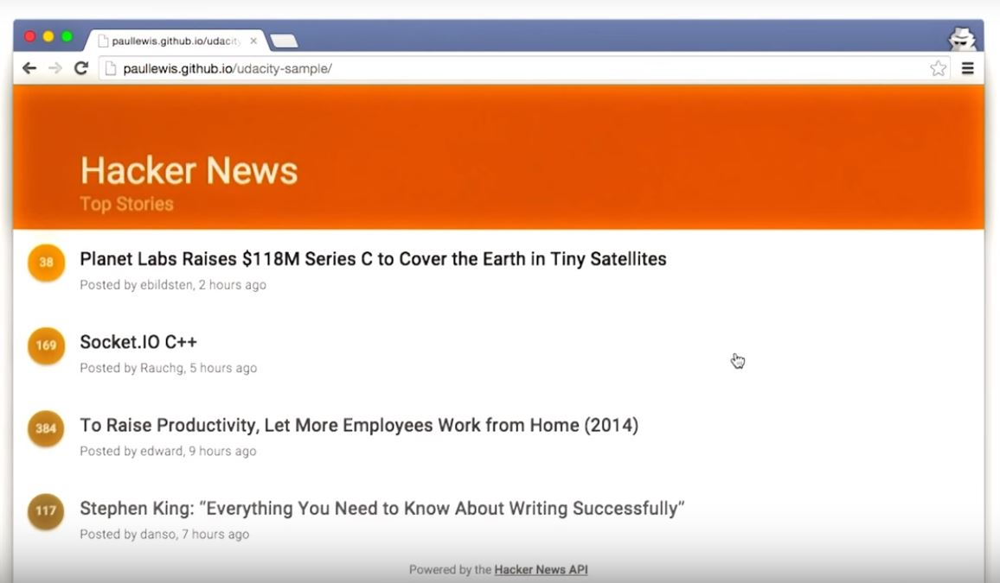

# Lesson 9.14 Final Project

Right now you are looking at the app that you'll be debugging at the end of this course. It uses the Hacker News API to show the most recent stories and their scores. Right now its performance is pretty awful, especially on mobile, but there's really no reason it shouldn't be hitting frames per second. By the end of this course, you'll have the skills, techniques, and above all, you'll have the mindset needed to turn this janky experience into an amazing frames per second experience. Ready to get started?

- - -
Next up: [Lesson Outro](ND024_Part4_Lesson09_15.md) or return to [Table Of Contents](./ND024_TableOfContents.md)
