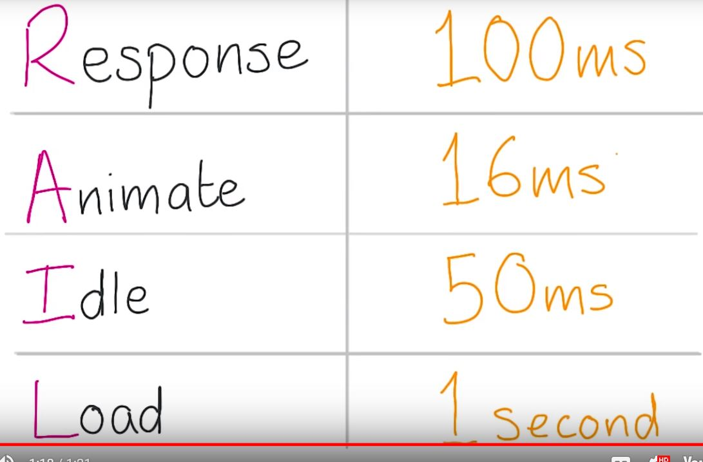

# Lesson 10.5 RAIL Response

Okay awesome, you've handled Load and considered what you might do during periods of idle time. But what next? Well, the user's going to interact with the app, and you need to be responsive to that. This isn't responsive in the sense that it responds to screens of different sizes. This is responsive in the sense that it reacts to the user input without delay. Well how responsive does it need to be then? Well, studies show that there is a limit of milliseconds. So a tenth of a second after someone presses something on screen before they notice any lag. So if you can respond to all user input in that time, you're good to go. That's great if the thing they did was to say, toggle a check box or tap a button. And you show a single change, like a selected state. But there's another version of this which is more challenging, which is that the user does something that requires animation. The most challenging performance issues always come out of the need to hit frames a second. Which is either interactions that stick to the user's finger or transitions and animations. For those we have a limit of milliseconds. Which is one second or a thousand milliseconds divided by . In reality, we actually have less than milliseconds, because the browser has overhead. So really we get around to milliseconds. That's not a lot of time.

- - -
Next up: [RAIL - Animations Part 1](ND024_Part4_Lesson10_06.md) or return to [Table Of Contents](./ND024_TableOfContents.md)
