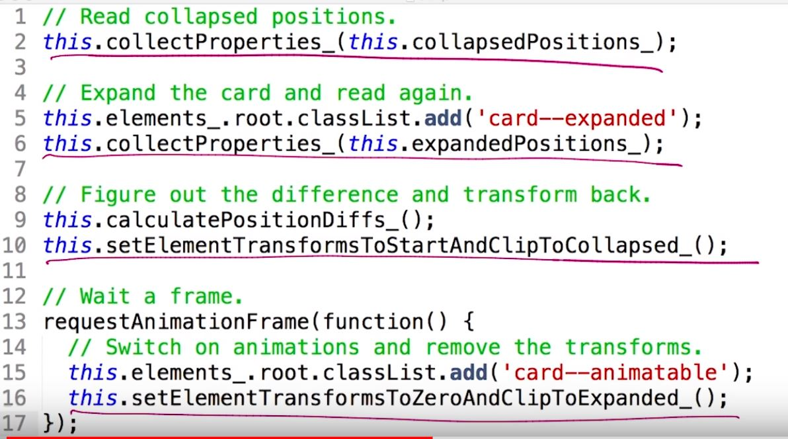
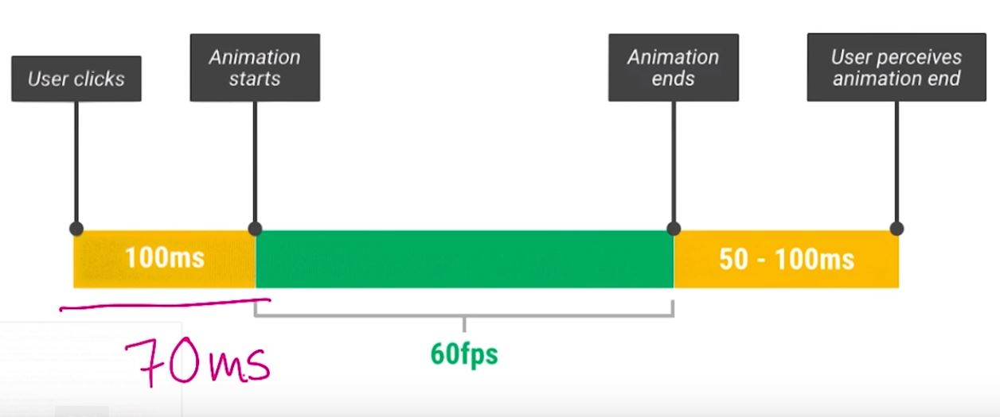

# Lesson 10.7 RAIL - Animations Part 2

And this is what it looks like in code. 
- Firstly, we collect the properties of the card in a collapsed position. 
- We expand the card and collect the properties again. 
- Next, we figure out the differences and then we transform the card back. Because we made this style change we have to wait a frame for those style changes to take effect. Otherwise, if we change them again the browser would ignore these and we'd see no animation. 
- Now we've waited a frame. We can switch on animations and remove the invert, transforms, and our past two changes. 

All that property collection, probably sounds quite expensive and you may be wondering how you can afford to do it. It sounds like a lot, and it is. I mean, you're doing all these calculations on demand whenever a user clicks or taps on a card. Well it turns out, I was making use of the millisecond response window to do all those experts of calculations up front. On a Nexus it took around milliseconds to get everything done, which is well inside that millisecond boundary.

[GitHub - udacity/devsummit: Chrome Dev Summit Site: A fast, Material Design conference site](https://github.com/udacity/devsummit)

[devsummit/card.js at master · udacity/devsummit · GitHub](https://github.com/udacity/devsummit/blob/master/src/static/scripts/components/card.js)

- - -
Next up: [Quiz: Rendering Animations](ND024_Part4_Lesson10_08.md) or return to [Table Of Contents](./ND024_TableOfContents.md)
