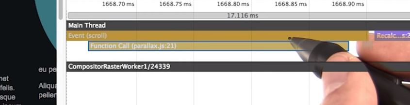
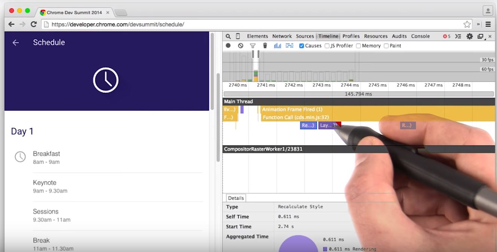

# Lesson 11.3 The Timeline in Depth

So I have the DevTools timeline open here and I had it record what happened during the load of this page. Let's take a look at the records in a little more detail. The first thing to notice is that they're color coded. **Blue records are HTML being parsed.** Now, normally this is really fast and I haven't personally seen a performance issue where this was the bottleneck, certainly not past the initial page load anyway. Moving along a little bit, and zooming in with the W key, just drag that along a little bit, you can see that we actually have two **purple records. One is Recalculate Style, and then there's Layout as well**. Let's zoom in a little bit more. And you can see I've got a **green one here which is Paint, and a green one which is Composite**. Okay, there are actually two ways you can view the timeline information, and it's really up to you as to which one you find more useful. 

Firstly, I'm going to record again, and scroll the page. Up here are the two options that we have. We can switch on and off the frames, although I don't know why you'd ever do that, so leave that on. But your options here are to use a **Flame Chart view** or not. Let's switch it off for a second by tapping here. Now, we have a slightly different view, which looks more like a **waterfall**. I can scroll up and down, and can also tap on records on the left hand side. The wider bar is in this view, the longer it took for the task to complete. The second view, which also happens to be the default, is the Flame Chart view. The chart grows down from the top, and if one part of the pipeline triggers something else, it's shown as a child record beneath its parent. I'm going to zoom in a little bit, maybe a little bit more, going to use the W key again. And I'm going to scroll across by click dragging. You can see here, this function call in Parallax.js was a child of this scroll event. 

Let's take a quick look at another example, this time the Chrome [Dev Summit site](https://developer.chrome.com/devsummit/). I'm going to record the timeline, and I'm going to expand the card. Let's take a look in this little bit here. When we zoom in on the area of interest you see that there's an animation frame that's fired, which called some other JavaScript, which caused some Recalculate Style, which caused some Layout. 

So you can start to build up a picture of what caused what. Take a look at both of these views. The old one with the waterfall, and the new one, the Flame Chart. It's the same information, just packaged in a slightly different way. It's really down to you which one you prefer. I often find that this view helps me understand the relationship between different parts of the pipeline. But give it a go on your own projects and find out which one works for you.

- - -
Next up: [Quiz: Reading the Timeline](ND024_Part4_Lesson11_04.md) or return to [Table Of Contents](./ND024_TableOfContents.md)
