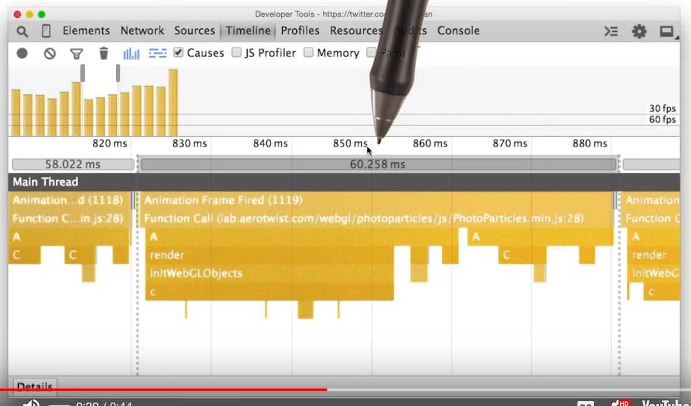

# Lesson 11.4 Quiz: Reading the Timeline

Paul just showed you something ridiculously awesome. With the timeline, you can watch how one piece of work causes another. I mean, that's just amazing, and so for this quiz, I want you to load a timeline. What? Load a timeline you say? You can do it pretty easily. Simply right-click in the timeline and go to Save As to save one, or Load to load a timeline. Loading a timeline is a super easy way to share and compare timelines. In the downloadable section, you can find this timeline. Once you've got it, simply right-click in any timeline and then load it for yourself. Once you've loaded the timeline, see if you can figure out which function caused initWebGLObjects() to run. Type it into this box. And finally, if this JavaScript was called during an animation, would it still be possible for the animation to reach frames per second? Yes or no.

I've got the Flame view open, and it's pretty apparent that some kind of work is being repeated over and over. I'll just go ahead and zoom into one of these chunks. With this closer inspection, it becomes pretty obvious that render is causing InitWebGLObjects to be called. At the top, you can see that the code ran for about milliseconds, which is well over the millisecond budget per frame. This unfortunately means that there is no way this app is going to run at frames per second. Looking at the frame viewer at the top, you can see that these frames are made up almost entirely of JavaScript, hence all the yellow bars. This means that this code is definitely going to need some refactoring if it's going to run at frames per second. So the correct answers are, render as the function and, no, it is not going to run at frames per second.

- - -
Next up: [Identifying Jank Sample](ND024_Part4_Lesson11_05.md) or return to [Table Of Contents](./ND024_TableOfContents.md)
