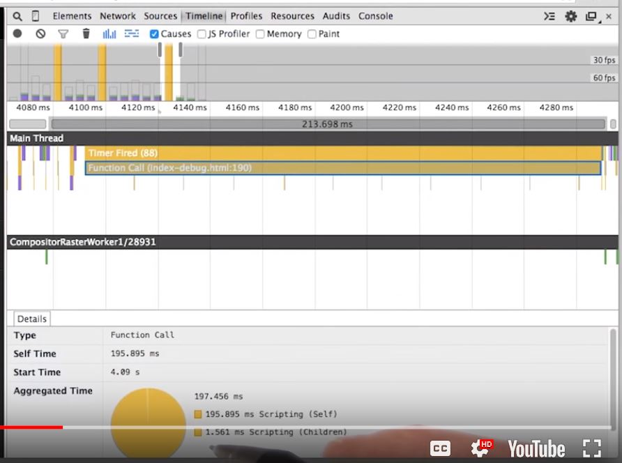

# Lesson 11.5 Identifying Jank Sample

Okay, I want to walk you through another example. This is a weight truck app I built a while ago. And I notice that when I open the menu on the left hand side, that it sticks and Janks. Watch. So now with the timeline open, I'm going to see if I can find out what the cause is. The first thing I'm going to do is refresh the page, just so that I know I've got a fresh start. Now what I'm going to do is, hit record. Come over here and bring out the menu and stop recording. 

Immediately, I see that there are three big spikes of yellow here. 

So, I'm going to select one of those and I realize that I am spending a lot of time in JavaScript. Once you zoomed in, you can also get details of what's going on in those frames. Let me start by dragging this up a little bit more, so we can see it. You can see what it is, how long it's been working, when it started and a little bit more about how it's broken down. The time itself and any child records. Lastly, you find out where the task was triggered In your code. The details will differ depending on the kind of record you're looking at. For example, recalculates dial, tells you the number of elements that were affected, as does layout. With layout, we see the tree size, the scope, where it started and in this case, we also see an additional warning. Which we'll talk about in a little bit. Lastly, we see where in the code we triggered layout. In this case though, I would be most concerned about these large yellow blocks. They seem to be what's causing me to stop hitting frames a second.

- - -
Next up: [Test… All the Devices!!!](ND024_Part4_Lesson11_06.md) or return to [Table Of Contents](./ND024_TableOfContents.md)
