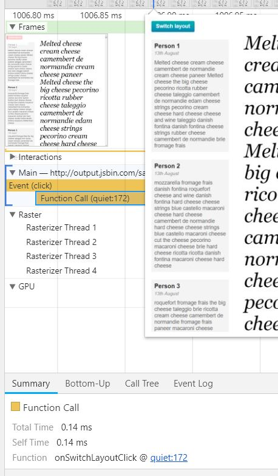

# Lesson 11.10 Quiz: More Timeline Practice

[Here's the test site to analyze](http://jsbin.com/saxalu/2/quiet)

Before this quiz starts, I want to talk **testing strategy**. First off, you want to make sure that you're collecting clean data. So, you should first quit any other apps that you have running besides the browser. Along the same lines, extensions can skew your results. So, make sure you're running your tests in an incognito window. You should also recognize that sometimes you may have several bottlenecks in your code, and they may be triggered in different ways from different parts of the pipeline. So, it's important that you focus on the causes of bottlenecks more than you focus on their symptoms. And lastly, with any performance issue, make sure you always measure first, before you start to apply fixes. There's no point in fixing an issue you don't actually have. And you won't be able to know how well your fixes actually work unless you've measured first, so that you can compare the difference. 

All right. Well, now it's time for you to practice your def tool skills and take a timeline recording of the website linked in the instructor notes. Limit the timeline to just scripting. And then start recording. Click on the Switch Layout button and then, see if you can figure out where the jank was caused inside the code. Type your answer into this box.

All right so I've got scripting checked off, and I'm going to hit record and see what happens when I click this button. Okay, here's my timeline. But you know, sometimes you can have a pretty good idea of where the cause of junk might be found in the pipeline, but other times it could be kind of tricky to find. And here, I think I need a little bit more space, so I will go ahead and pop this into its own window. Now, I see a bunch of frames here, and these all happened after the button clicked. So, I want to know what happens right when the button clicks, which is going to be right in the beginning. It looks like the last scripting thing to happen before all the layouts happened right here. So, I'll go ahead and zoom in. I clicked on this last scripting event, and it looks like that was just a mouse move, and that's not what I'm looking for right now. So, I'll jump back a little further. All right now this scripting event looks a little bit more exciting because it came from a click which is the last thing that I did. I zoomed in a little bit further to see that this event caused a function to run, I'll click on it in see that it's location is in this quiet file at line . Click on that to see what it's referring to in fact this function On switch layout click is definitely the culprit that i'm looking for here. Toggling wide on the body is causing all of those janki long layouts. So, the correct answer is the function. On switch layout click.

- - -
Next up: [Quiz: Finding Janky Functions](ND024_Part4_Lesson11_11.md) or return to [Table Of Contents](./ND024_TableOfContents.md)
