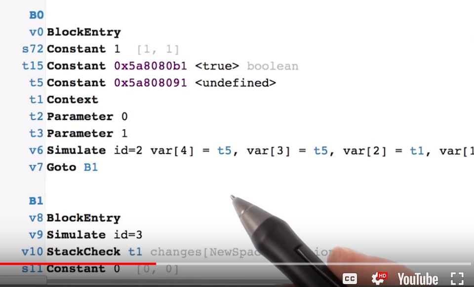

# Lesson 12.2 Just in Time

Okay, the first thing you need to know about JavaScript, is that the code you write, isn't actually the code that runs. Now that may sound a little strange if you never heard it before, but it comes about because of the fact that modern JavaScript engines recompile your code to something that can run more quickly. 

**It's done thru a Just In Time compiler, or JIT. **

A JIT compiler will optimize the JavaScript bit by bit as it runs, and it's a brilliant but extremely complex engine. For us as developers, what that means is that there's no way to look at JavaScript and know exactly what code will run in the engine. Take a look at this JavaScript code here. It's a for loop, it's pretty simple. But if we use this tool called IRHydra to look at how Chrome's JavaScript engine V would look at representing it, it looks like this. Now you don't need to understand any of this. This is just how Chrome and its V JavaScript Engine understands the code that you wrote. 

But what I want you to take away here is that you should avoid what we call micro-optimizations. Micro-optimizations come about when you try to write code that you would think would be a little bit faster for a browser to run. Like say, which is faster, this for loop or this while loop? But the thing is, we don't know how the JavaScript engine is going to treat these two pieces of code. So there's no point in guessing. Any **micro-optimization** you write should be a last resort once you've exhausted all your other options. In short, what I'm saying is don't spend your time comparing similar pieces of JavaScript in this way. It won't help you. There are other things you can do to improve performance that don't involve micro-optimizations. So you're done, right? I mean, you can't guess exactly how a JavaScript engine is going to handle your code. So obviously we can move on. Well, no, actually. It turns out there are plenty of things that you can do to make your code run better. So let's get started.

- - -
Next up: [Quiz: Optimizing JS for Animations](ND024_Part4_Lesson12_03.md) or return to [Table Of Contents](./ND024_TableOfContents.md)
