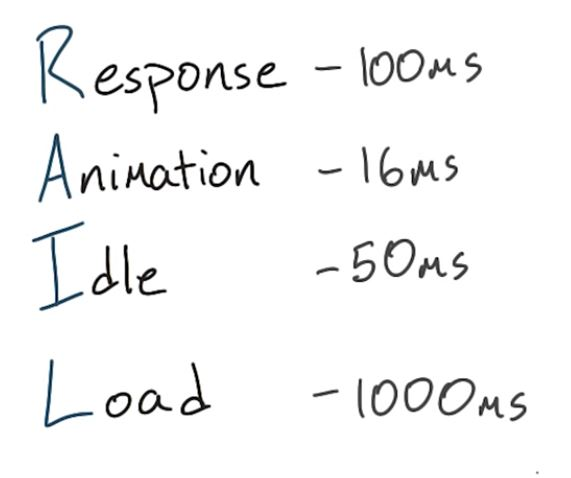

# Lesson 12.3 Quiz: Optimizing JS for Animations

While you shouldn't concern yourself with micro-optimizations like this one, there are obviously steps you can take to ease JavaScript's burden on the rendering pipeline. And that should be obvious, because otherwise, there would be no need for this lesson to exist. Think back to the different stages of RAIL. 

Each stage has a different window of time to execute JavaScript without incurring a user experience penalty. That is to say, you have a small amount of time to execute JavaScript, and if all of it happens before the window of time is over, the app will still feel snappy and smooth. Looking at this timeframe for an animation, you realistically only have about ten milliseconds to do everything you need to do to prepare the frame, which includes running layout, compositing, and paint. 

So, with that in mind, how do you make sure JavaScript is out of the way as much as possible to hit that ten-millisecond deadline? Should you optimize your JavaScript to eke every last nanosecond out of your code? Should you execute JavaScript every milliseconds on a rigid schedule? Should you defer JavaScript to the very end of the frame, to get the hard work done first? Or should you execute JavaScript as early as possible every frame? Pick one of these four answers.

For the first one, no. Remember, micro-optimizations really aren't that helpful. For the second one, not quite. While it may seem like a good idea to execute JavaScript on a millisecond schedule, this doesn't necessarily guarantee that JavaScript is always executing at the right time for each frame. The third one isn't right either. You need to make sure that JavaScript is done as early as possible, because it can lead to style calculations, layout, and paint. In fact, this answer doesn't even really make sense, because the frame is done when the pixels are painted. So, the last answer is correct. The beginning of every frame is definitely the best time to run JavaScript because remember, it can create style, layout, paint and compositing changes. And finishing JavaScript early means you have as much time as possible to take care of everything else.

In the next video, you will learn about request animation frame which is an API that will schedule your JavaScript to run at the right point of every frame.

- - -
Next up: [requestAnimationFrame](ND024_Part4_Lesson12_04.md) or return to [Table Of Contents](./ND024_TableOfContents.md)
