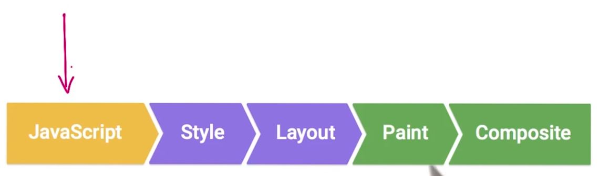
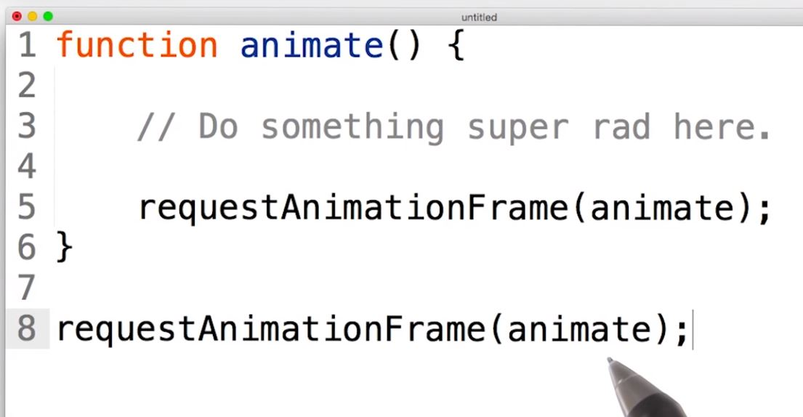

# Lesson 12.4 requestAnimationFrame

RequestAnimationFrame should be your go to tool for creating animations. Nobody likes to be interrupted in the middle of a task, and the browser is no different. Remember how little time the browser has to render the frame at 60 frames a second. If one second is a thousand milliseconds and we have to fit frames in, well we have 16 milliseconds. Realistically though, there's some overhead to running a frame and the browser has housekeeping to do. So we should aim for about **10 milliseconds instead.**

**The JavaScript part of your frame should typically be kept around three to four milliseconds at most.** Because there's going to be other work, like style calculations, layer management, and compositing that will come afterwords. I want you to imagine that the browser is in the middle of doing some style work. And then, in comes some JavaScript that needs attention. The browser now has to deal with the JavaScript that just came in before it can move on to other tasks. That new JavaScript may cause the work for the frame to be redone, and that could well mean missing the frame. 

**RequestAnimationFrame schedules your JavaScript to run at the earliest possible moment in each frame.**

That gives the browser as much time as possible to run your code, then style, then the layout, painting, and compositing. A lot of older code around the web that is used for animation, uses setTimeout or setInterval, because back in the day that's all there was. In fact, jQuery still uses setTimeout for its animation today. The problem with both of these functions is that the JavaScript engine pays no attention to the rendering pipeline when scheduling these. They're good functions to use when you want to wait some time to elapse or do some repeated task every so often, but they're not a good fit for animations. 

This is how you use requestAnimationFrame. You make a call to it and tell it which function you want it to call. That gets called where you do your animation. And at the end of it you schedule the next one. The browser takes care of when it should run and how. Of the many browsers available to users today, the only one that doesn't support requestAnimationFrame is Internet Explorer 9. So, for that you'd need to use a polyfill, which would use setTimeout. It's not ideal as a fall back, but it will allow you at least to use requestAnimationFrame in your code and not worry about compatibility. Check out the instructor notes for more information.

- - -
Next up: [JavaScript Profile](ND024_Part4_Lesson12_05.md) or return to [Table Of Contents](./ND024_TableOfContents.md)
