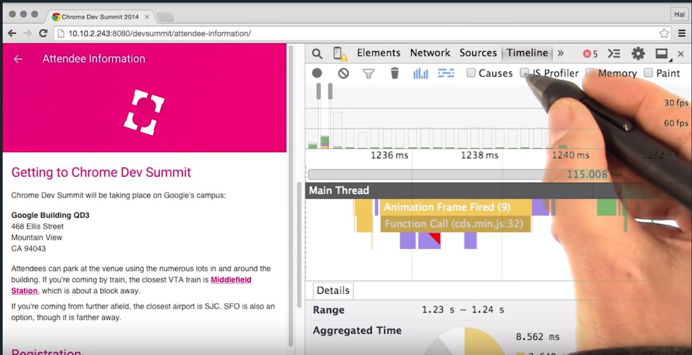

# Lesson 12.5 JavaScript Profile

Hopefully, all your JavaScript is running at the right time in the frame. And that's great. But now, you need to make sure that it's not taking too long to run. Remember that to meet frames a second you have to fit all the work inside milliseconds. And that's not just JavaScript but everything for our frame. In reality, we have to be inside of ten to milliseconds to leave the browser some time for it's housekeeping. It's easy for JavaScript to take quite some time to run, especially if you are using frameworks and libraries because they will need some time to do their work. Whether that's organizing views in your app or handling callbacks or perhaps, even analyzing data. 

And now I'm back in Chrome's DevTools, and I'm going to take a look at its JavaScript profiler. This is going to tell us not just that I spent time in JavaScript, but which functions, where, and for how long. Normally, when we record and interact with the site we don't get a lot of information on JavaScript. For example, here we can see that I've called some JavaScript. We don't know anymore about what was called or why. If I check this box, in the UI, and then re-record. 

And now you can see with the JavaScript profiler on, I get a lot more information. And if I hit the W key to zoom in a bit more, we can see they called an expand function followed by collect properties. The JavaScript profiler is a great tool to use when you know that you have long-running JavaScript. You shouldn't leave it on all the time. You should really only look to use it when you know you have a problem with long-running JavaScript. And now armed with this extra information, I can find my bottlenecks more easily.

- - -
Next up: [Quiz: Long Running JS](ND024_Part4_Lesson12_06.md) or return to [Table Of Contents](./ND024_TableOfContents.md)
