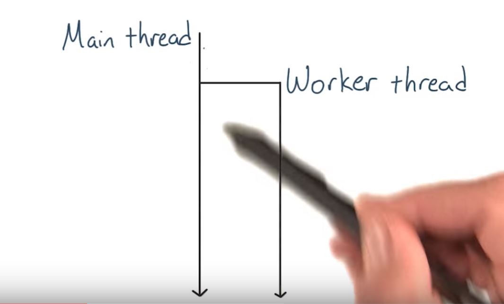
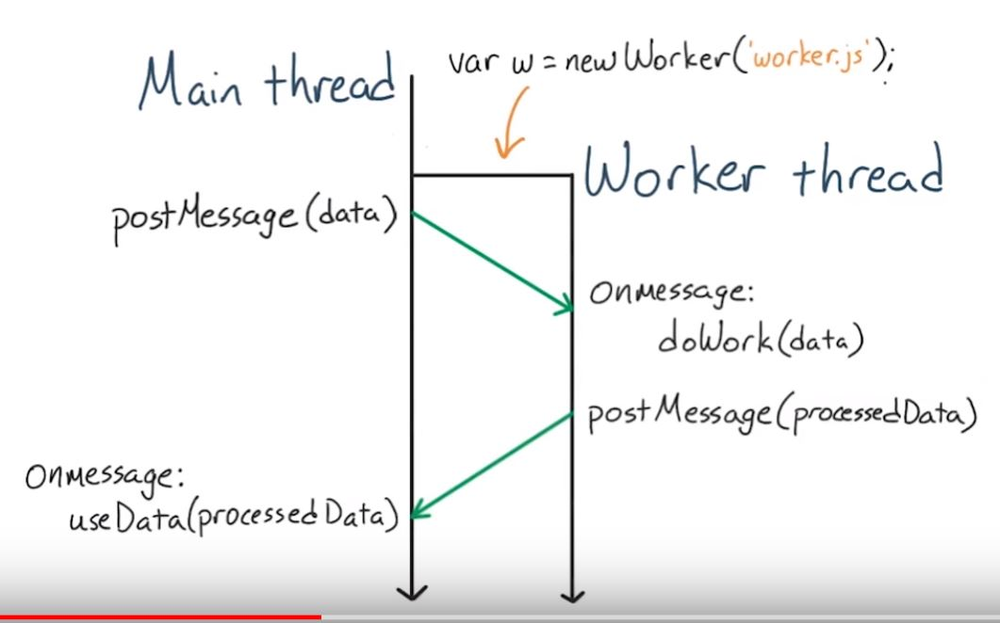
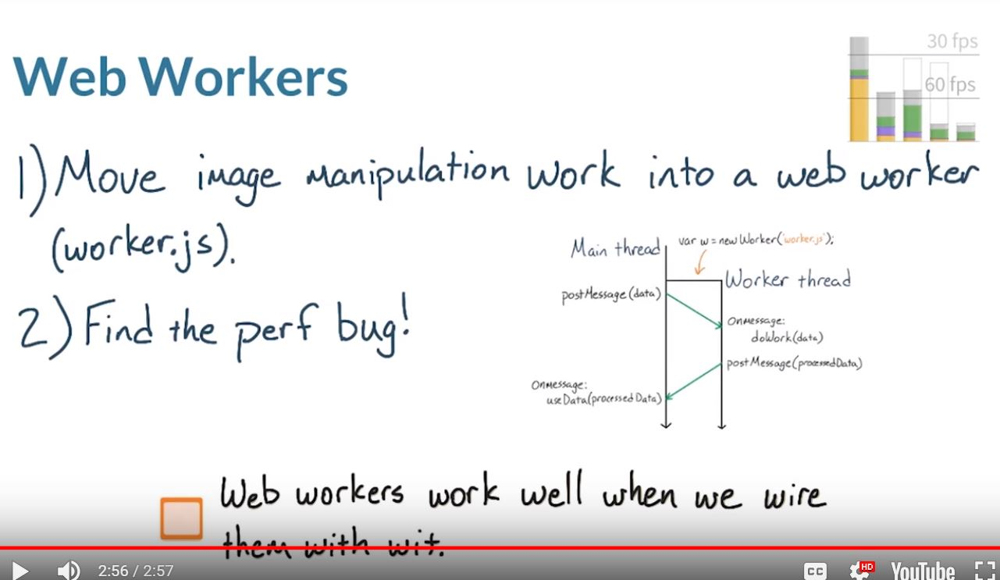

# Lesson 12.7 Quiz: Web Workers

[Here's the image manipulation repo!](https://github.com/udacity/web-workers-demo)

[Using Web Workers - Web APIs | MDN](https://developer.mozilla.org/en-US/docs/Web/API/Web_Workers_API/Using_web_workers)

[The Basics of Web Workers - HTML5 Rocks](http://www.html5rocks.com/en/tutorials/workers/basics/)

You'll need to host the site on a local server. If you're unfamiliar with how to do that, [check out this concept from the HTML5 Canvas course](https://classroom.udacity.com/nanodegrees/nd001/parts/00113454010/modules/269645859775461/lessons/3163218691/concepts/32309787260923), which documents how to serve files.

Wait a second. Paul just mentioned something called a Web Worker. These are really super useful, so you're going to be creating one for this next quiz. Web workers provide an interface for spawning scripts to run in the background. Normally, websites run in a single thread running on the operating system. Web workers allow you to run javascript in a totally different scope than the main window, and on a totally separate operating system thread. 

Whatever work is happening in the main thread in the main window won't affect or be affected by the worker thread, and of course the opposite is true. Whatever work is happening in the worker thread won't affect or be affected by the main window but the two can send messages back and forth. This means that you can isolate long running Javascript inside a worker thread and allow the main thread to run free unimpeded. 

What's really cool though is that the Web Worker in the main thread can communicate with each other. Altogether, web workers are an incredibly valuable strategy for running long running code that does not treat any jank on the main thread. If you're unfamiliar with web workers check out the link in the instructor notes below. Essentially you'll need to create a separate javascript file which your main app will spawn into a new Web Worker. 

For this quiz, I want you to download and de-jankify this small app. You'll need a copy on your local machine and you can find a link to download it below. I want to point out the two main features of this app. On the left side, there is the jank timer which will tell you if any jank appears on the page. And on the right side there is the image manipulator which will let you pick a file from your local machine and then do some type of image manipulation on it. In this case, I've just gone ahead and uploaded a chrome logo. 

The image manipulator's janky and needs a little bit of work. Watch what happens when I click invert, the page froze for more than seconds as this image was being inverted. That is definitely a lot of jank and that needs to be fixed. 

Your job for this quiz is to offload all the image manipulation work off the main thread and into a Web Worker. You'll know you've done it correctly when the page doesn't freeze for multiple seconds when you click one of these buttons. 

As a second challenge, there's also a massive performance bug in the way the image manipulators run. I'm about to give you a big hint about where it is in the app. So if you want a really nice challenge right now just stop and click Continue to quiz and skip this hint. Okay. Are you still here? Here it comes. Inside image-app.js you can find this loop which includes the logic for separating each pixel into the different channels and then running some manipulation on them. This function manipulate is where you should start looking for the performance bug. To help you out with the Web Worker I'm including a file called worker.js, that currently handles most of the Web Worker. It's going to be your job to go into image-app.js and then install worker.js as a Web Worker. So once you've moved the image manipulation work into a Web Worker and you found the performance bug, check this box to let us know

- - -
Solution:
[GitHub - udacity/web-workers-demo at solution](https://github.com/udacity/web-workers-demo/tree/solution)

Here's the differences between initial and solution:
[solution · genchau/web-workers-demo@2468d0b · GitHub](https://github.com/genchau/web-workers-demo/commit/2468d0b8e2756b65d06c4bf080db0eefb99ba67f)

It makes sense to start by taking a look at worker.js. Notice that when it receives a message from the main thread, it's going to get two things, the image data and the type of manipulation. E is the whole message from the main thread. And then the data is the user data that we're sending to the worker. So, when I post a message to the web worker, I'll make sure that both of these are included. Back in the image app or in this case, my solution to it, notice that the loop is gone from manipulateImage. That's because the loop now lives in worker.js. At the top of the script, I created the web worker from worker.js and I just called it imageWorker. Whenever I need to use the web worker, I'll use the reference imageWorker. Whenever I need to post a message to the worker or receive a message from the worker, I'll refer to it as imageWorker. Back in the image app or in my case the solution to the image app, I'll start by creating a new web worker. The syntax is fairly simple. And then once I create it from worker.js I can simply refer to it with this variable name. Down below in manipulateImage, you'll notice that the whole loop is gone. And that's because it's being handled by the worker. When I'm ready for the worker to start doing its work, I'll simply post a message to it by calling postMessage on the variable for the worker that I created above. And remember, the worker is expecting image data in type, so I'm sending it an object of both. Here the image data is being collected from the canvas after an image is uploaded. And the type here is coming from the button that was pressed. Here, let me show you. Each of the image manipulation buttons has an onclick handler, which posts a different string representing the type of manipulation that should happen. This type here gets passed to manipulateImage. Next up is the onmessage handler attached to the worker. This function will be run once the worker sends something back. First off, I toggle the ButtonAbledness. So that's what grays out or grays back in, I guess, all the image manipulation buttons at the top of the page. And then I go ahead and grab the data, and then return it to the context. Next up there's the onmessage handler that's attached to the web worker. This function gets run once the web worker returns something back to the main thread. One again, it passes a message back which is called e here. And the actual image itself in the web worker is e.data. Assuming that there is an image, it gets put right on the canvas. As a good practice, I also included an onerror handler on the web worker. It also calls a function, which in this case throws a web worker exception. All right. Now let's see how all of this runs. I've opened the solution in the browser and I've loaded the Chrome image like before. I'll hit Invert and watch. No Jank, it doesn't freeze up, and then a few seconds later, the new one appears. Notice that there was no huge stutter. There was no Jank appearing in the timer. That's a really good sign that, that work, that image manipulation work, is happening off the main thread. Notice how the work pretty much stays under frames per second the whole time. That's awesome. And also down here in the view, you can see the WebCore worker being spawned. This worker's work down here is all of the image manipulation that happened off the main thread. Very cool. But, there is still that performance bug. Let me show you what it is. Remember, I said to start with the manipulate function before. This manipulate function can be found inside ImageManips.js. The whole of ImageManips.js is this manipulate function. And then, using the string types that were passed to it, it decides what that function should be equal to. And then it runs the function using the parameters passed from the worker. Okay, that seems fairly reasonable, but why is this a bug. Notice how this is happening inside the for loop. That means, for each and every pixel on the page, a new function object has to get created. And that's just a lot of overhead for the browser. So, I refactored this loop. Outside of the loop, I figure out which function I need. I'll show you where this function came from in a second. And then I simply call that function inside the loop. This is much more performant because I'm not creating a new function every time I hit a new pixel. GetManipFunc is the replacement for manipulate from before in imagemanips.js. And instead of running one of the image manipulations on a pixel, it simple returns the function. This allows me to use the function over and over inside the for loop without creating a new one each time. So, how does this perform? Let me show you. I've got the before and after fixing that performance bug. First off, notice how the new timeline looks way better than the old one. And the function itself run by the web worker finished in only one second, which compares very well to the five seconds when it was done poorly. All in all, I would be very happy seeing this timeline on any app.

- - -
Next up: [JS Memory Management](ND024_Part4_Lesson12_08.md) or return to [Table Of Contents](./ND024_TableOfContents.md)
